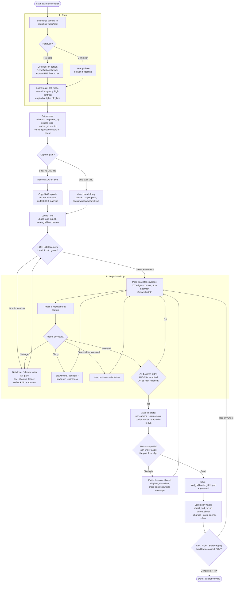

# Underwater ChArUco Calibration — Procedure Flowchart

Setup: waterproofed ZED camera fixed to an underwater robot, ChArUco board moved
by an operator, controlled over an Ethernet tether via VNC.

Render this diagram in any Mermaid-aware viewer (GitHub, VS Code Markdown preview,
mermaid.live).

## Notes keyed to the flow

- **Calibrate in water** — refraction changes focal length + distortion; a dry
  calibration is invalid underwater.
- **Capture path** — the SVO-record-then-replay-topside path avoids VNC lag and the
  moving-board timing problem entirely; strongly preferred.
- **HUD** — full board = (squares_x-1) x (squares_y-1) = 14 x 10 = **140** corners for the
  AndyMark 15x11 board. Underwater turbidity lowers N; ChArUco still uses partial views, so
  do not chase 140 — green (6+ corners) is enough to capture.
- **Keys** — capture: `S` / `s` / spacebar (use `S` if VNC eats spacebar); quit: `q` / `Esc`.
  Give the window focus first.
- **Sharpness gate** — `min_sharpness = 100.0` may reject good-looking underwater frames;
  can be exposed as a `--min_sharpness` flag if needed.
